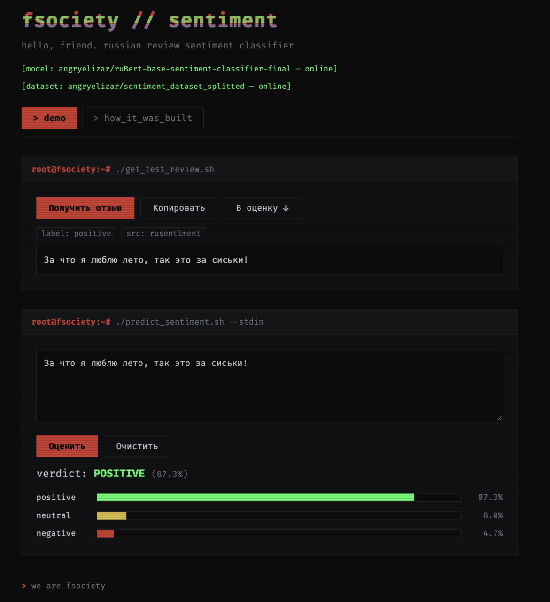

# #1 Capstone: Text Classifier на PyTorch & BERT

**Attractor School · Bishkek, 2026**

FastAPI web app that classifies Russian-language reviews into three sentiments —
**neutral**, **positive**, **negative** — using a `ruBert-base` model fine-tuned on
a ~300k-review dataset. You can type any Russian text and get predicted sentiment
with per-class confidence scores, or browse random labelled samples from the test
split. Final model accuracy on the test split: ~77%.



## Model & dataset

Both artifacts are mine (fine-tuned / prepared as part of this capstone):

- Model: [angryelizar/ruBert-base-sentiment-classifier-final](https://huggingface.co/angryelizar/ruBert-base-sentiment-classifier-final)
- Dataset: [angryelizar/sentiment_dataset_splitted](https://huggingface.co/datasets/angryelizar/sentiment_dataset_splitted)

## Quick start (Docker)

Prerequisites: Docker Desktop (or any Docker engine with Compose v2).

```bash
docker compose up --build
```

Then open [http://localhost:8000](http://localhost:8000).

Notes:

- **First start downloads** the model and dataset from the Hugging Face Hub (~1-2 GB, internet required). Afterwards they are kept in the `hf_cache` Docker volume, so subsequent `up`/`down` cycles start in seconds.
- Stop with `Ctrl+C`, or run in background with `docker compose up --build -d`.
- To reset the cached model/dataset: `docker compose down -v`.

## Configuration

All settings are hardcoded in `app/config.py` (deliberately — this is a demo). To change the model, dataset, or the number of samples kept in memory, edit that file and rebuild:

```bash
docker compose up --build
```

## Running without Docker

Prerequisites: [uv](https://docs.astral.sh/uv/) — cross-platform, auto-installs Python 3.13.

macOS / Linux:
```bash
curl -LsSf https://astral.sh/uv/install.sh | sh
```

Windows (PowerShell):
```powershell
powershell -ExecutionPolicy ByPass -c "irm https://astral.sh/uv/install.ps1 | iex"
```

Then:

```bash
uv sync
uv run uvicorn app.main:app --host 127.0.0.1 --port 8000
```

## API

- `POST /api/predict` — body `{"text": "..."}` → predicted label + scores
- `GET /api/sample` — a random labelled review from the dataset